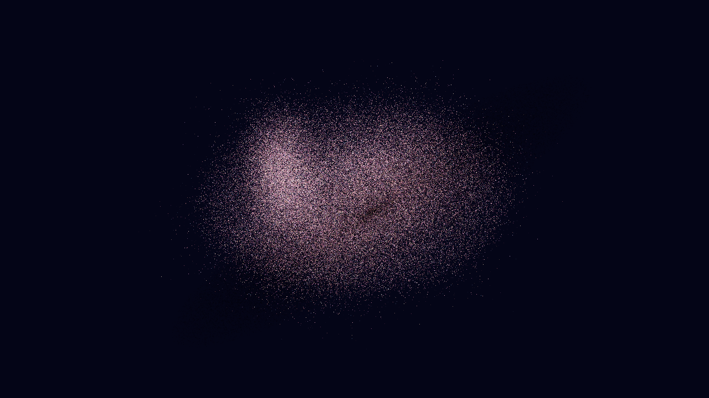
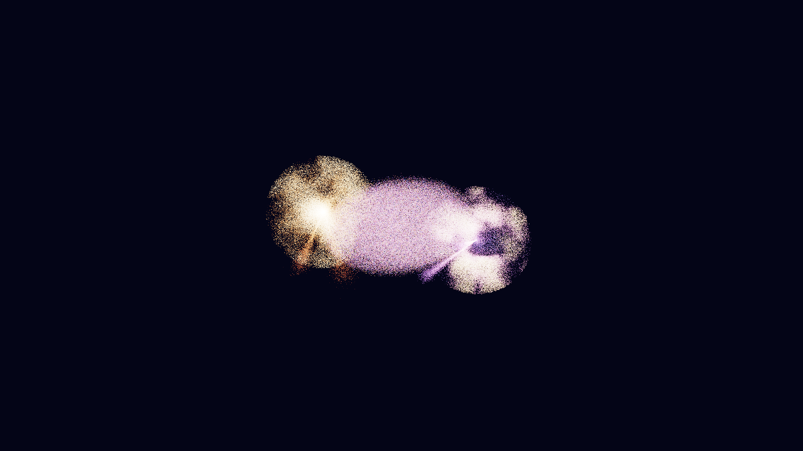
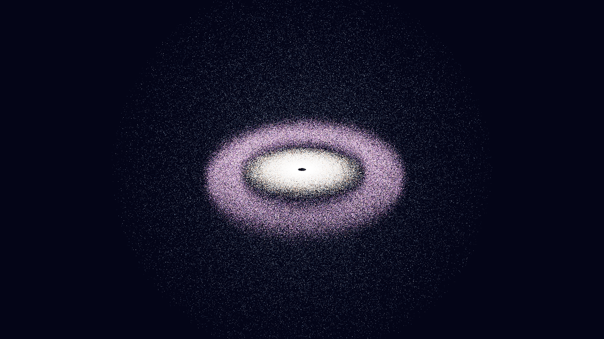

# Nebula Dust Engine

Procedural nebula dust and particle groups for [three.js](https://threejs.org).
Sow seeded clouds of dust anywhere in a scene, then move, rotate, recolor, touch,
save and share them. Each group is one draw call of up to millions of GPU samples,
with distance and performance LOD that keeps the total light constant.

**[Live editor demo](https://orbitas.gmartos.es/nebula-dust-engine/demo/)**

| Emission nebula + dark lane | Collision with debris | Disk, ring and halo |
| --- | --- | --- |
|  |  |  |

*The three example scenes, rendered offline with the real shaders (`npm run screenshots`).*

- 14 presets (Orion, Pillars of Creation, Horsehead, Crab, Ring, Helix, Lion,
  interstellar dust, galaxy dust, Oort cloud, supernova, white-dwarf accretion,
  Betelgeuse dust shell, WR 104 pinwheel) and 14 morphologies × 11 palettes.
- **Seeds**: the same seed and options always give the same cloud, sample by sample.
- **Groups**: add, update in place, duplicate, hide, remove, reorder, put on layers.
- **Picking** with a raycaster, **gizmo** friendly (plain `Object3D`s), and **touch**:
  a local push computed in the vertex shader that fades out by itself.
- **Save/load** a whole scene as JSON, or as a short compressed link.
- A shared budget of **4,000,000 samples** split proportionally between groups.
- **Rotating outflow** (`createDustOutflow`, new): matter streaming out of a spinning
  compact source, with conserved angular momentum, relativistic Doppler colour and
  beaming, a volumetric cloud integrated per ray, and up to 16.7 M samples that cost
  **zero bytes** (everything comes from a hash of `gl_VertexID`).
- **LOD that keeps the light**: distance, frame time and caps only change *how many*
  samples are drawn, never how bright the cloud is.
- No dependencies besides `three` (peer, r150–r189). Plain ES modules, no build step.

## Install

```sh
npm install three nebula-dust-engine
```

ES modules straight from a CDN (no bundler):

```html
<script type="importmap">
{
  "imports": {
    "three": "https://cdn.jsdelivr.net/npm/three@0.180.0/build/three.module.js",
    "nebula-dust-engine": "https://cdn.jsdelivr.net/npm/nebula-dust-engine@0.4.0/src/all.js"
  }
}
</script>
```

Requires WebGL2 (three.js dropped WebGL1 in r163; the vertex shader uses `gl_VertexID`).

## Minimal example

```js
import * as THREE from 'three';
import { createDustSystem } from 'nebula-dust-engine';

const dust = createDustSystem({ renderer, lightReferenceSamples: 786432 });
scene.add(dust.object3d);

const id = dust.addGroup({ preset: 'orion', seed: 'my-nebula', position: [0, 0, 0] });
dust.updateGroup(id, { palette: 'crab', tint: '#ffd0a0', size: 1.3 });

renderer.setAnimationLoop(() => { dust.update(camera, clock.getDelta()); composer.render(); });
```

A complete page with sowing and touching is in [`examples/basic.html`](examples/basic.html).

**Render into a HalfFloat target.** Each sample carries very little light; in an 8-bit
canvas most of it rounds to zero. Use `EffectComposer` with a `HalfFloatType` render
target and an `OutputPass` (tone mapping + sRGB), as the example does.

## Dust system API

`createDustSystem(options)` returns a system. Every option except the ones below is
passed to every group's engine (`renderer`, `adaptive`, `lightReferenceSamples`,
`physicalGrainCount`, `resolutionScale`, `minPointPx`, `nearLodDistance`, `touchDecay`…).

| Option | Default | Description |
| --- | --- | --- |
| `maxTotalSamples` | `4000000` | Samples shared by all groups. Above it, every group is scaled down proportionally. |
| `measureGpuTime` | `false` | One GPU timer query for the whole system; its time feeds every group's adaptive LOD. |
| `seed` | `'dust'` | Base for the seed of groups created without one (`<seed>-<id>`). |
| `groups` | – | Initial groups (same format as `load`). |
| `onChange` | – | Listener for every change event. |

### Group spec

A group is described by a flat object. `addGroup` accepts any subset; the stored spec
is always complete, and it is exactly what `serialize()` writes.

| Field | Description |
| --- | --- |
| `id` | String id (`g1`, `g2`… when not given). |
| `name` | Display name. |
| `preset` | Preset key or alias (`'orion'`, `'m42'`, `'betelgeuse'`…): fills morphology, palette, seed, opacity, size, motion… Explicit fields win. |
| `seed` | String or number. Same seed + same spec = same cloud. |
| `morphology` | `diffuse`, `orion`, `pillars`, `horsehead`, `crab`, `ring`, `bipolar`, `lion`, `galaxy`, `oort`, `supernovaEjecta`, `whiteDwarfAccretion`, `clumpyShell`, `pinwheel`. |
| `palette` / `colors` | A palette name (`webb`, `orion`, `ionized`, `crab`, `dark`, `galaxy`, `oort`, `supernova`, `accretion`, `redSupergiant`, `hotDust`) or 2–16 colors (`'#rrggbb'`, CSS names, `THREE.Color`, RGB triples). |
| `tint` | Color multiplied over every sample (`'#ffffff'` = none). |
| `blending` | `'normal'` (dust that hides what is behind) or `'additive'` (light). |
| `volumeProfile` | `mist`, `balanced`, `dense`, `emissive`. |
| `count` | Samples for this group, or `null` for the GPU tier budget (16 k to 2 M). |
| `radius` | Size of the cloud in scene units. |
| `position`, `rotation`, `scale` | `[x, y, z]` (rotation in radians, XYZ order); `scale` also accepts a number. |
| `opacity`, `size`, `maxPointSize` | Visual strength, sample size multiplier, pixel cap per sample. |
| `motion`, `flowSpeed` | Shader-only wobble and orbital/infall flow. |
| `evolution`, `evolutionRate` | Explosion progress (0–1) and its speed per second. |
| `order`, `layer`, `visible` | `renderOrder`, three.js layer (0–31) and visibility. |
| `physicalGrainCount` | Real grains this group represents (only reported, never drawn). |
| `shape` | Morphology parameters: `shellInner`, `shellOuter`, `clumpScale`, `clumpContrast`, `plumeCount`, `plumeFraction`, `spiralPitch`, `spiralSense`, `spiralPhase`, `spiralInner`, `armWidth`, `coneOpening`, `radialFade`. |

### Methods

| Method | Description |
| --- | --- |
| `addGroup(spec)` → `id` | Creates a group. Throws on an unknown preset (nothing is left half-built). |
| `sow(point, spec)` → `id` | `addGroup` at a point (`Vector3` or `[x, y, z]`), with a random seed unless one is given. |
| `updateGroup(id, patch)` → `boolean` | Changes a group. Color, palette, tint, blending, opacity, size, motion, flow, evolution, transform, order, layer, visibility and name apply instantly; seed, preset, morphology, radius, volume profile, shape and count regenerate the samples and dispose the old buffers. |
| `resetGroup(id)` | Back to its preset (or defaults), keeping id, transform, count, order, layer and visibility. |
| `duplicateGroup(id, patch)` → `id` | Copy of a group (same seed unless the patch changes it). |
| `removeGroup(id)` / `clear()` | Dispose one group / all of them. |
| `listGroups()` | `[{ id, name, preset, morphology, palette, blending, visible, order, layer, requestedSamples, sampleCount }]`. |
| `getGroup(id)` | `{ id, spec, engine, object3d }` (a copy of the spec and the live engine). |
| `groupIdOf(object3d)` | Group id of an `Object3D` (or any child), e.g. the one a gizmo is attached to. |
| `captureTransform(id)` | Reads the group's `Object3D` transform back into its spec (call it on a gizmo's `objectChange`). |
| `serialize({ view, title })` | The scene as a JSON-safe object: `{ format: 'nebula-dust-scene', version, engine, maxTotalSamples, groups, view?, title? }`. |
| `load(json)` → `{ ids, view, title }` | Replaces the scene (object or string). The whole file is validated before anything is touched. `serialize → load → serialize` is identical. |
| `pick(raycaster \| ray, { all, layer })` | The group under a ray: bounding sphere first, then whether the ray really passes near its samples; among several, the one with samples under the ray and the smallest radius. `all: true` returns the sorted list `{ id, distance, point, radius, score, onSamples }`. |
| `pickScreen(ndcX, ndcY, camera, options)` | `pick` from normalized device coordinates. |
| `touch(point, { radius, strength, id })` → `count` | Pushes the samples near a world point away from it, in every group within reach (or only `id`). Four live touches per group; they fade with `touchDecay` seconds. |
| `update(camera, deltaSeconds)` | Per frame: LOD, time, touches. Returns the samples sent to the GPU. |
| `isAnimated()` | Whether anything changes without camera motion (render on demand when `false`). |
| `beginGpuFrame()` / `endGpuFrame()` / `reportGpuFrameTime(ms)` | GPU time for the adaptive LOD. |
| `probeFrame(camera)` | CPU estimate of the samples drawn and the light they carry. |
| `setOptions(patch)` / `getOptions()` | Common options. `resolutionScale`, `minPointPx`, `maxVisibleSamples` and `touchDecay` apply live; `maxTotalSamples` re-splits; others rebuild. |
| `getStatus()` | Groups, requested / allocated / visible samples, cap, animation, GPU timer. |
| `on(type, fn)` / `off(type, fn)` | Events: `add`, `update`, `rebuild`, `remove`, `clear`, `load`, `options`, and `change` for all of them. After `rebuild` the group has a new `Object3D`: reattach gizmos there. |
| `dispose()` | Frees everything and removes `object3d` from its parent. |

### Helpers

| Export | Description |
| --- | --- |
| `encodeDustScene(scene)` / `decodeDustScene(text)` | Scene ↔ short text for a URL (`z` + deflate-raw + base64url, or `j` + plain base64url without `CompressionStream`). |
| `projectToViewPlane(ray, camera, target)` | Where a ray crosses the plane through `target` facing the camera: the point to sow or touch. |
| `randomDustSeed()` | A short random seed string. |
| `normalizeDustGroupSpec(input, base)` | The complete, validated spec (idempotent). |
| `DUST_EXAMPLE_SCENES` | `twinNebula`, `collision`, `diskRingHalo`, ready for `load`. |

### Moving groups with a gizmo

```js
import { TransformControls } from 'three/addons/controls/TransformControls.js';

const gizmo = new TransformControls(camera, renderer.domElement);
scene.add(gizmo.getHelper ? gizmo.getHelper() : gizmo); // r169+ / older
gizmo.attach(dust.getGroup(id).object3d);
gizmo.addEventListener('objectChange', () => dust.captureTransform(id));
dust.on('rebuild', (e) => { if (e.id === id) gizmo.attach(e.engine.object3d); });
```

## Single cloud API

The engine behind every group can be used alone:

```js
import { createNebulaDustEngine, createNebulaDustPreset } from 'nebula-dust-engine';

const cloud = createNebulaDustPreset('supernovaExplosion', { renderer, radius: 42 });
scene.add(cloud.object3d);
cloud.update(camera, dt);
```

Options: `renderer`, `quality` (0–4), `sampleCount`, `maximumSamples`, `morphology`,
`palette`, `colorStops`, `tint`, `volumeProfile`, `radius`, `seed`, `opacity`,
`particleScale`, `maxPointSize`, `motion`, `flowSpeed`, `evolution`, `evolutionRate`,
`blending`, `renderOrder`, `physicalGrainCount` / `dustMassKg` / `dustMassSolar`,
`adaptive`, `targetFrameMs`, `gpuBudgetMs`, `minimumLod`, `nearLodDistance`,
`farLodDistance`, `maxVisibleSamples`, `resolutionScale`, `minPointPx`,
`lightReferenceSamples`, `touchDecay`, the shape parameters above.

Methods: `update`, `setOpacity`, `setParticleScale`, `setMaxPointSize`, `setMotion`,
`setFlowSpeed`, `setEvolution`, `setEvolutionRate`, `restartEvolution`, `setPalette`,
`getPaletteStops`, `setTint`, `setBlending`, `setRenderOrder`, `touch(localPoint, radius,
strength)`, `clearTouches`, `setTouchDecay`, `setResolutionScale`, `setMinPointPx`,
`setMaxVisibleSamples`, `beginGpuFrame`, `endGpuFrame`, `reportGpuFrameTime`,
`isAnimated`, `probeFrame`, `getStatus`, `dispose`.

### Samples, not grains

No browser can draw 10¹⁸ dust grains. Each GPU sample is a Monte Carlo sample of a much
larger population: `physicalGrainCount` (or a dust mass) is reported next to
`grainsPerSample`, but never drawn. The GPU budget comes from a conservative GPU
detection (16,384 to 2,000,000 samples per cloud, 4,000,000 hard cap, 36 bytes each).
With `lightReferenceSamples`, a cloud has the same total light with 16 k or 4 M samples:
more samples make it finer, not brighter. The distance and performance LOD draw a random
subset and give the missing light to the samples that remain.

### Depth

Samples are transparent points with depth test and no depth write: they sit behind
opaque objects correctly and mix with other transparent layers by `renderOrder`.

## Rotating outflow

`src/outflow.js` (subpath `nebula-dust-engine/outflow`) is a separate entry point for a
continuous outflow from a rotating compact object. It was written for the white hole of
[Orbit Universe](https://orbitas.gmartos.es/es/#e=ah-blanco) (the time reverse of a Kerr
black hole), but nothing of the application is inside.

```js
import { createDustOutflow } from 'nebula-dust-engine/outflow';

const flow = createDustOutflow({
  renderer,
  radius: 40,                 // outer radius, scene units
  innerRadius: 1.2,           // where matter leaves the source
  sampleCount: 2_000_000,     // allocated: costs no memory, see below
  maximumSamples: 16_000_000, // ceiling for sampleCount
  maxVisibleSamples: 524_288, // drawn at start; the frame-time LOD moves it
  lightReferenceSamples: 4_000_000,
  omega: 0.4,                 // spin of the source (rad per time unit, signed)
  schwarzschildRadius: 1,     // fixes the terminal speed: γ∞ = γ0 + rs / 2r0
  betaMax: 0.97,
  targetFrameMs: 33.3,        // adds samples up to 30 fps, removes them below
  cloud: { intensity: 1, dust: 1 }  // the volumetric cloud (optional)
});
scene.add(flow.object3d);
renderer.setAnimationLoop(() => { flow.update(camera, clock.getDelta()); composer.render(); });
```

Until the next npm release it can be loaded from GitHub through jsDelivr:
`https://cdn.jsdelivr.net/gh/ecomyseo/nebula-dust-engine@main/src/outflow.js`
(with `three` in the import map, as above).

### What it models

- **Angular momentum.** Matter leaves radius r₀ co-rotating with the source (Ω r₀) and
  then keeps its angular momentum, v_φ = Ω r₀² cos λ / r: every sample spirals out and
  straightens. The radial speed goes from β₀ to β∞ with a time constant τₐ, in closed
  form: r(τ) = r₀ + β∞ τ − (β∞ − β₀) τₐ (1 − e^(−τ/τₐ)). `outflowRadial()` is the CPU
  twin of the shader, for tests.
- **Rotating sprinkler.** Streams leave fixed nozzles on the spinning source, so the
  continuous flow draws spiral arms that rotate with Ω and open as they accelerate. More
  matter at the equator (`latitudePower`), two narrow straight jets along the axis.
- **Relativistic Doppler.** Colour is a temperature, T ∝ r^(−slope), seen shifted by
  D = 1 / (γ (1 − β cos θ)); brightness goes as D³ (`beamExp`, with `beamFloor` and
  `beamCap`). β never reaches 1 (`betaMax`). `relativisticDoppler()` and
  `kerrHorizonOmega()` are exported with the same formulas as the shader.
- **Dust.** A second population (normal blending, `dustSampleCount`, a quarter by
  default) that is slower, larger and red-brown, and partly hides what is behind.
- **Sink** (`setSink`): an optional black hole that bends what passes near and swallows
  what enters its capture cross-section.
- **Nothing covers the camera**: size in world units, a pixel cap (`maxPointSize`) and a
  fade of whatever would grow beyond `nearFade` times the cap.

### The volumetric cloud

Points never become "infinite"; a continuous medium does, at a fixed cost. With
`cloud: {}`, an impostor sphere (0.6 of the outer radius by default) integrates along each
ray the emission of the wind (density ∝ 1/r², more at the equator), modulated by the same
rotating arms as the samples, with the Doppler colour of the local velocity and a dust
shell that absorbs. It uses **six samples per ray, spaced uniformly in the angle
θ = atan(l / b) seen from the centre**: for a 1/r² density that integrates the radial part
exactly (∫ dl / (b² + l²) = Δθ / b) and puts the samples where the matter is, with no
banding. Blending is `ONE, SRC_ALPHA` (added light, background multiplied by the dust
transmission). Close up the cloud carries the light; far away the samples take over. It
costs per covered pixel, not per sample.

### Samples without buffers

The outflow has no per-sample attributes: position, age, stream, colour and size come
from a hash of `gl_VertexID`, so the CPU touches nothing per frame and allocating 16 M
samples costs no memory (`metadata.bytesPerSample === 0`). The cycle of each sample is
s = fract(phase + t · rate), with the rates quantised to 1/64, so the clock wraps every
1024 units without a jump: the flow never empties and needs no warm-up.

### `maximumSamples`

For the outflow, the limit is not memory but what is **drawn**. `sampleCount` is capped by
`maximumSamples` (default and hard cap `OUTFLOW_MAX_SAMPLES` = 2²⁴, where `gl_VertexID`
is still exact in a float), and the LOD decides how many of them are drawn. In the dust
engine (`createNebulaDustEngine`), `maximumSamples` caps the samples of one cloud below
the 4,000,000 limit that the 36 bytes per sample impose.

## Performance guide

Measured on an integrated AMD Radeon (the laptop GPU this was built on) with the real
shaders:

| Points drawn | Point size | GPU time |
| --- | --- | --- |
| 1,000,000 | 1 px | 9.6 ms |
| 1,000,000 | 2 px | 15.7 ms |
| 1,000,000 | 4 px | 26.6 ms |
| 4,000,000 | 1 px | 39 ms |
| 393,216 (outflow, 720p) | mixed | ≈ 5.5 ms |

- **A point is not free.** Budget what is drawn, not what is allocated: start from the GPU
  tier (`detectGpuProfile`: 16 k, 64 k, 262 k, 786 k and 2 M samples per cloud) and let
  the frame-time LOD (`adaptive`, `targetFrameMs`) move from there.
- **Size costs more than count.** Doubling the point size costs more than doubling the
  number of 1 px points; keep `maxPointSize` low and let samples be many and small.
- **Light per sample goes with flux, not with area.** A sample's light is constant
  (× 1/z²) and its size only spreads it. With light ∝ drawn pixels, the few big, cold
  samples dominate and the cloud turns into a saturated blob.
- **Keep the light with `lightReferenceSamples`.** With it, 16 k or 16 M samples give the
  same total light: more samples make the cloud finer, not brighter, and the LOD can cut
  freely.
- **Render into HalfFloat** with an `OutputPass`. A `ShaderMaterial` drawn straight into
  the 8-bit canvas gets no tone mapping, no exposure and no sRGB: the dust looks black.
- **ANGLE on Direct3D unrolls loops with a constant bound.** Keep ray-marching loops
  short (the cloud uses 6 steps) or bound them with a uniform; a long unrolled loop can
  take tens of seconds to compile and a draw call over two seconds resets the GPU.
- **Still camera, no animation → render on demand** (`isAnimated()`).

## Avoiding walls

A volume that lives in a box must never be cut by the box. Density that reaches the faces
of [−1, 1]³ ends in a straight edge, and as soon as the camera turns the nebula is an
aquarium. The dust engine's morphologies are radial and fade by themselves
(`shape.radialFade`); if you feed your own density or combine the engine with a
ray-marched volume, multiply everything — gas, dust and samples — by a round envelope
that is 0 on every face, the same function on the GPU and on the CPU:

```glsl
// superellipsoid |x|³ + |y|³ + |z|³: no flat faces, zero on the box
float boxEnvelope(vec3 p, float inner, float outer) {   // e.g. 0.72, 0.92
  vec3 a = abs(p);
  return 1.0 - smoothstep(inner * inner * inner, outer * outer * outer, dot(a * a * a, vec3(1.0)));
}
```

The irregular edge comes from the turbulence of the gas itself; an extra noise on the
envelope was measured at 4 % of the volume cost and could not be seen. And judge a volume
from several views (front, 45°, side, top, back): anything computed from x and y alone is
a cylinder along the line of sight, and from the side it is a wall.

## Editor demo

[`demo/`](demo/) is a full editor ([live](https://orbitas.gmartos.es/nebula-dust-engine/demo/)).
Its panel follows the one of spite's
[Bumpy Metaballs 2026](https://spite.github.io/bumpy-metaballs-2026/), built with
[guspira](https://github.com/spite/guspira): a dark, foldable panel on the right with
the selected group in its title, folding sections inside four tabs, sliders with their value
(click the value to type one, click a label to randomize that control), and the pause,
random, fullscreen and hide buttons beside it. On a phone it sits at the bottom, folded.

- Above the tabs: help, the key table, the **preset** (‹ ›), the **mode** (**Orbit**:
  drag the view, tap to select; **Sow**: tap to plant a preset or a bare shape;
  **Move**: TransformControls gizmo; **Touch**: drag to push the dust) and its options.
- **Scene**: example scenes, save/load JSON, copy link, clear; the group list (select,
  hide) with add, duplicate, hide and delete; auto-rotate, visible layers, reset view.
- **Group**: name, seed, samples, shape and its parameters, palette or custom colors,
  tint, volume, blend, opacity, sample and point sizes, position, rotation, scale,
  draw order, layer, flow, turbulence, explosion, reset.
- **Render**: quality (samples per group), sample budget, adaptive LOD, frame cap,
  half resolution, sub-pixel culling, represented grains; exposure, ACES tone mapping,
  bloom (strength, radius, threshold), grain and vignette.
- **Stats**: fps, CPU and GPU time per frame, samples drawn, sent and allocated.

| Key | |
| --- | --- |
| ← → | previous and next preset (on the selected group) |
| R | random look |
| Space | pause (the engine clock stops, nothing is drawn) |
| Tab | hide the interface |
| F, double-click, double-tap | fullscreen |
| 1 2 3 4 | Orbit, Sow, Move, Touch |

The address bar always holds the whole scene as readable parameters, written only
when they differ from their base (a fresh group of the preset, or the example the scene
started from):

```
#preset=orion&seed=3&samples=262144&opacity=0.7
#scene=collision&g3.pos=0,0.25,0.02&g3.turb=0.6&view=20,14.3,3.6,0,0,0&bloom=0.8
```

Group parameters (`gN.` prefix from the second group on): `preset`, `name`, `seed`
(digits are a number, `"42"` in quotes is text), `samples`, `shape`, `palette`, `colors`,
`tint`, `volume`, `blend`, `opacity`, `size`, `maxpx`, `radius`, `pos`, `rot` (degrees),
`scale`, `order`, `layer`, `hidden`, `flow`, `turb`, `evo`, `evorate`, `pgrains` and the
shape ones (`shellin`, `shellout`, `clump`, `contrast`, `plumes`, `plumefrac`, `pitch`,
`sense`, `phase`, `spiralin`, `arm`, `cone`, `fade`). Scene: `scene`, `view`
(azimuth, elevation, distance, target), `sel`. Render: `exposure`, `aces`, `bloom`,
`bloomradius`, `bloomthreshold`, `grain`, `vignette`, `quality`, `budget`, `fps`,
`halfres`, `adaptive`, `cull`, `dustgrains`, `spin`, `layers`. Older links still open:
the compressed `#s=…` of 0.4.0 and plain names such as `#orion`, `#m42`, `#collision`.

The image goes through a HalfFloat target and one grade pass (`demo/post.js`), so a
still scene costs the GPU nothing and bloom at 0 costs nothing either.

## Development

```sh
npm install
npm test               # engine, presets, system, outflow, GLSL, demo in a fake DOM
npm run test:mutants   # re-breaks the demo on purpose and checks the tests notice
npm run screenshots    # renders media/*.png offline (Python + moderngl + Pillow)
```

`test/glsl-versions.mjs` compiles the shader with `glslangValidator` (set `GLSLANG` or
put it on the `PATH`) using the chunks of the installed three and of any other
`three.module.js` passed as arguments; it has been checked with r150, r160, r169 and r180.

## Limits

- It is a visual model: no radiative transfer or magnetohydrodynamics, no FITS data.
- Touches are visual displacements; they do not change the stored samples.
- Picking uses up to 1,500 samples per group; very thin edge-on disks may need a
  slightly off-axis click.
- The outflow is special relativity on a flat background: Doppler shift, beaming and
  speeds below c, but no light bending, no aberration of the sky behind it and no
  "starbow" (Orbit Universe draws those in its own passes). Its sink bends and swallows
  samples as a visual approximation, not along geodesics.
- The outflow's cloud blends with a scalar alpha: the absorption of the background is
  achromatic.
- The outflow is not a group of `createDustSystem` yet: no save/load, picking or touch.
- Source comments are in Spanish; the public API, README and demo are in English.

See [CHANGELOG.md](CHANGELOG.md) for the history.

## Credits

Created by **Gustavo Martos Ferri** for [Orbit Universe](https://orbitas.gmartos.es),
an n-body space simulator. Morphologies are inspired by public imagery from NASA/ESA/CSA
(Hubble, JWST), ESO (VLT/VISIR, Kervella et al. 2011 for Betelgeuse) and Keck
(Tuthill et al. 2008 for WR 104). Built on [three.js](https://threejs.org).

The demo's panel is modelled on the one of
[Bumpy Metaballs 2026](https://github.com/spite/bumpy-metaballs-2026) by Jaume Sánchez
([@thespite](https://github.com/spite)), MIT License, Copyright (c) 2022 thespite, whose
panel is [guspira](https://github.com/spite/guspira), MIT License, Copyright (c) 2026
Jaume Sanchez. `demo/panel.css` adapts guspira's `css/gui.css` and the page styles of
bumpy-metaballs-2026 and carries both licence notices; `demo/panel.js` is this demo's own
code written after guspira's API and behaviour; the ACES curve in `demo/post.js` is the
one three.js uses (MIT).

## License

[MIT](LICENSE) © 2026 Gustavo Martos Ferri
